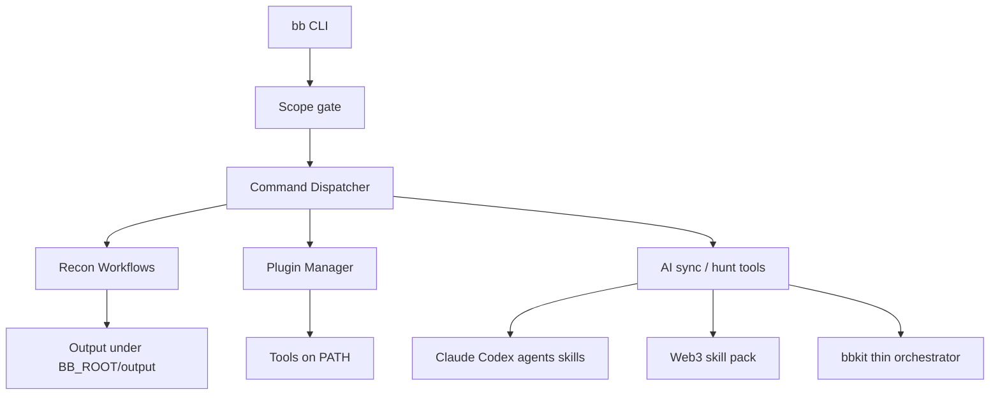

# Architecture

## Components

- `bin/bb` — main CLI dispatcher  
- `lib/common.sh` — logging, tool helpers, **scope allowlist**  
- `lib/program_hunt.py` — program-oriented helpers (`bb bounty`)  
- `plugins/` — install/update/doctor for external tools  
- `recon/` — workflows (subs, full, scope, ai-sync, …)  
- `skills/bbkit/` — thin AI orchestrator (scope-first modes)  
- `templates/engagement/` — scope.md templates  
- `ref/claude-bug-bounty/` — vendored AI methodology (upstream MIT)  
- Runtime `$BB_ROOT` (`~/BugBounty`) — output, engagements, installed AI  
- `config/config.yaml` → `load_bb_config`  
- `lib/dashboard.py` + `bb dashboard`  
- `Dockerfile` / `docker-compose.yml` for VPS  

