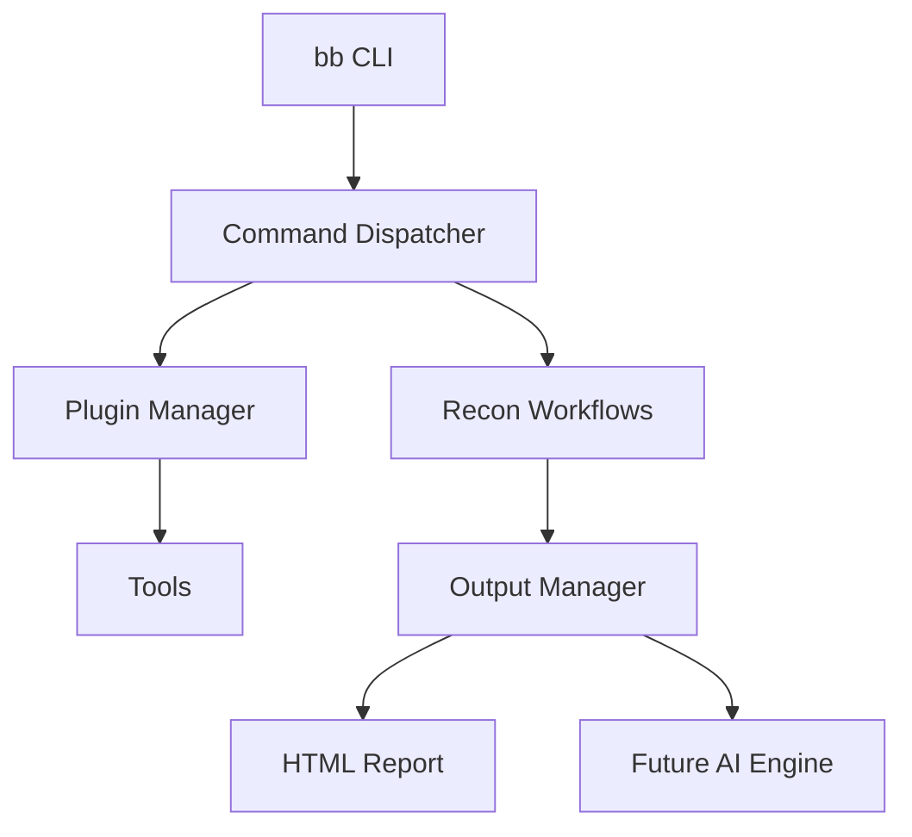

# Architecture

## Components

- `bin/bb`: main CLI.
- `lib/common.sh`: shared helper functions.
- `plugins/`: tool installation, update, and doctor definitions.
- `recon/`: workflow commands.
- `wordlists/`: DNS/content/parameter/API wordlists.
- `templates/`: nuclei and gf templates.
- `output/`: scan results.
